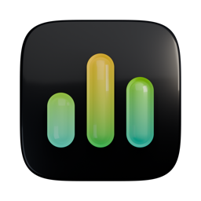

<div align="center">



# hallmonitor

**A hall monitor for your coding agents.**
Claude Code, Codex and opencode, on this machine and your servers, in your terminal, menu bar and notch.


https://github.com/user-attachments/assets/0703b8dc-140a-412b-a699-1a08c8b7aa7e


[Install](#install) · [The app](#the-app) · [The board](#the-board) · [Notch & menu bar](#notch--menu-bar) · [Usage & limits](#usage--limits) · [Other machines](#other-machines) · [Privacy](#privacy)

</div>

---

You start an agent, switch to something else, and ten minutes later wonder: is it done? Is it stuck waiting for approval? Which of the five terminals was it in? hallmonitor answers that at a glance:

- **Who's working, who's idle, who needs you**: every Claude Code, Codex and opencode session, live.
- **What each one is doing**: current tool, last prompt, model, context size, and how many subagents it has running.
- **Across machines**: your laptop, dev box and GPU server on one board, over plain SSH.
- **How much you use them**: agent-hours, tokens, cache hits, plan limits.

It only reads, unless you turn on answering from the notch; then it hands back exactly the answer you click, nothing else.

## Install

```bash
brew install hiteshbandhu/tap/hallmonitor             # the board (macOS, Linux)
brew install --cask hiteshbandhu/tap/hallmonitor-app  # menu bar + notch app (macOS 14+)
```

Or download a binary from [Releases](https://github.com/hiteshbandhu/hallmonitor/releases), or build from source with Go 1.26+:

```bash
go install github.com/hiteshbandhu/hallmonitor/cmd/hallmonitor@latest
```

Then:

```bash
hallmonitor          # the board
hallmonitor --demo   # a demo fleet, to see it before your agents are running
```

**Coming from agentboard?** It's the same tool, renamed. `brew upgrade` moves you over, `agentboard` still works as a command, and your usage history, hosts and status line carry over on first run.

## The board


Cards are grouped into **Needs you → Working → Idle**. Working cards spin; cards that need you pulse amber and say why (a permission prompt, a question, an error). Each card shows the project, model, context size, current tool, last prompt and a timeline of recent activity, and the waveform up top is your whole fleet over the last few minutes.

| Key | |
|---|---|
| ← ↑ ↓ → | move between cards |
| `enter` | open the agent's app (the Claude app on that session, or its terminal) |
| `f` | filter: all / Claude / Codex / opencode |
| `s` | show sessions idle for over a day |
| `u` | usage & limits |
| `q` | quit |

Put it on a second display and leave it there.

## The app


Open **Hall Monitor** from the menu bar (⌘O) or the Dock for the full picture in a native window: every agent as a card with what it's doing, its last prompt, subagents and a five-minute timeline; details in the side panel; Return or a double-click jumps to it. **Usage** charts agent time per day, plan limits, when you work and your top projects, models and tools; **Machines** shows each SSH host and lets you add or remove them. It's light on your Mac: ~1% CPU in the menu bar, a few percent with the window open.


## Notch & menu bar


On a MacBook, hallmonitor lives around the notch: small ears show who's working, it drops open when an agent needs you or finishes a long task, and hovering the notch lists everything in flight. Click an agent to jump to it: the Claude app opens on that session, and terminal agents bring their terminal (Terminal, iTerm, Ghostty, cmux, VS Code, Cursor, tmux…) to the front. The rest of the time, clicks pass straight through.

**Answer from the notch.** Turn on *Answer Claude's questions from the notch* in Settings and, when Claude Code asks you something or wants permission to run a tool, the question drops out of the notch: click an option (or type your own answer), or Allow / Deny. It uses Claude Code's own hooks (`hallmonitor hook`, added to `~/.claude/settings.json` with a backup); if you don't answer within two minutes, or pick *Answer in Claude*, Claude asks you the usual way. It applies to Claude Code sessions started after you turn it on.


The menu bar item is a regular macOS menu: agents with their project and status, today's usage, plan limits, and shortcuts to open the board. You also get a notification when an agent needs you.

Settings let you turn the notch, notifications, the agent count and plan usage in the menu bar on or off, and launch at login.

The app never asks for access to your folders: project icons are only looked up inside project folders, and never in Desktop, Documents, Downloads or Library.

<br clear="right">

## Usage & limits


Press `u` on the board, or run `hallmonitor usage`. hallmonitor keeps a small local ledger of how you use agents, built from what Claude Code, Codex and opencode already record: agent-hours per day, when in the week you work, top projects, models and tools, and cache hit rate. It keeps only counts; no prompt text is stored.

**Plan limits** show in the board's top bar and in the menu:

- **Codex**: read automatically from Codex's own logs.
- **Claude Code**: the menu bar app and the board open Claude Code's own `/usage` screen in the background every 15 minutes and read the 5-hour and weekly limits off it, so they stay current even when all your sessions are in the Claude desktop app. Claude Code uses its own login for that (hallmonitor never sees a token), and `/usage` sends nothing to the model, so it doesn't count against your limits. Turn it off in the app's Settings, or with `HALLMONITOR_NO_PROBE=1`; `hallmonitor usage --probe` reads them right now.

  For readings after every reply in terminal sessions, also point Claude Code's status line at hallmonitor once:

  ```bash
  hallmonitor statusline --install
  ```

  It backs up `~/.claude/settings.json`, and keeps your existing status line if you have one. Limits refresh every time Claude Code replies in a terminal session and show up on the board within a few seconds. A reading older than 15 minutes is shown with a `~` (`~71%`) so you know it's not live.

## Other machines

hallmonitor watches remote hosts over SSH, with no daemon or open port. Install hallmonitor on the server, then:

```bash
hallmonitor --host dev@gpu-box --host build-01
```

Or list hosts, one per line, in `~/.config/hallmonitor/hosts`. Each host keeps one SSH connection streaming `hallmonitor --stream`, reconnects on its own, and shows up as a chip in the top bar (green when live, red with the error when it isn't). Key-based SSH login is required; if `hallmonitor` isn't on the remote's PATH, pass `--remote-cmd /path/to/hallmonitor`.

## How status works

| | Source | States |
|---|---|---|
| Claude Code | `claude agents --json`, `~/.claude/sessions/*.json`, the session transcript | working, needs you (with the reason), idle, blocked |
| Codex | live `codex` processes and their session logs; the Codex app-server when it's running | working, needs you, idle, error |
| opencode | live `opencode` processes (the TUI, `run`, `serve`) and their sessions in opencode's database, both the classic and the v2 message store | working, needs you (when it asks a question), idle, error |

opencode keeps permission prompts in memory, not in its database, so an opencode session waiting for permission shows as working; one asking a question shows as needing you.

Sessions idle or blocked for more than a day are tucked away (`s` shows them).

## Terminals and logos

Provider logos are drawn as real images in terminals that speak the kitty graphics protocol (Ghostty, cmux, kitty, WezTerm), and as colored ✻ Claude / >_ Codex / ▣ opencode marks elsewhere. `--images off` turns them off. Logos come from the Claude, ChatGPT and OpenCode apps if they're installed; otherwise Claude's mark is fetched once from Simple Icons and cached (`--no-fetch` to never touch the network).

## Privacy

- Local and read-only by default. No telemetry, no accounts.
- The one exception is opt-in: with *Answer from the notch* on, the answer you click is handed back to Claude Code through its hooks. Nothing is ever sent without your click.
- Reads session metadata and transcript tails on your machine; never your auth files or tokens. opencode's database is opened read-only.
- To read Claude plan limits it runs Claude Code's `/usage` in safe mode (no hooks, MCP servers, plugins or tools) in its own empty folder, and removes that session's transcript afterwards.
- The usage ledger (`~/.local/share/hallmonitor/usage/`) stores counts only.
- Remote hosts use your own SSH, and send the same metadata back.

## Reference

```text
hallmonitor [flags]
  --demo                 synthetic fleet
  --host user@host       also watch a machine over SSH (repeatable)
  --view agents|usage    screen to open on
  --provider claude,codex,opencode
  --cwd ~/code/project   only sessions under a directory
  --once | --json        print once and exit
  --images auto|kitty|blocks|off
hallmonitor usage [--days 7|30] [--json] [--probe]
hallmonitor statusline [--install] [--then '<your status line>']
hallmonitor hook --install | --uninstall   # answer from the notch
```

## Building

```bash
go build ./cmd/hallmonitor     # the CLI
macos/build.sh --install      # the menu bar app (needs the Xcode command line tools)
scripts/release.sh 0.1.0      # release artifacts
```

`launch/` has the scripts that make the launch film: an original beat synthesized in Python and procedural motion design in Blender.

## License

MIT
